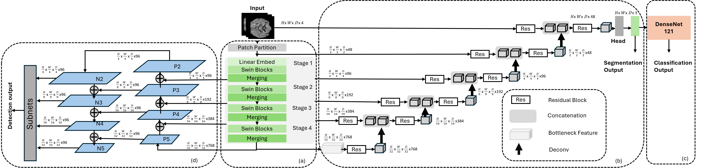
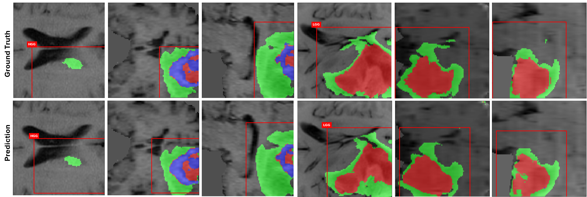

# MultiSwin
In this work, we propose **MultiSwin**, a novel **Swin** Transformer-based **Multi-task** model to address the limitations of single-task models by jointly performing brain tumor detection, segmentation, and glioma grading classification. Our model utilizes a Swin Transformer backbone and employs hard parameter sharing, which involves sharing encoders across all tasks, followed by task-specific decoders for each task. The proposed framework is evaluated on the BraTS 2018 dataset, achieving promising results across all three tasks. Additionally, we compare the performance and efficiency of our multi-task model with that of single-task models. Our multi-task model demonstrates a significant reduction in computational costs and faster inference speed while maintaining comparable performance to the single-task models. The architecture of MultiSwin is illustrated below:


## Installation
**Create a Conda Environment**
```
conda create -n multiswin python=3.8 -y
conda install pytorch==2.1.2 torchvision==0.16.2 torchaudio==2.1.2 pytorch-cuda=11.8 -c pytorch -c nvidia
```
**Install Additional Requirements**
```
git clone https://github.com/fanlimua/MultiSwin.git
cd MultiSwin
pip3 install -r requirements.txt
```

## Dataset
MultiSwin is tested on the BraTS 2018 dataset for brain tumor detection, segmentation, and glioma grading classification. Download the dataset from the official BraTS 2018 website.

## Training
To train MultiSwin, run the following command:
```
python main.py --json_file /path_to_data_annotation.json \
               --data_dir /path_to_imageTr2018 \
               --seg_label_dir /path_to_labelTr2018 \
               --num_epochs 200 \
               --task multi \
               --multi_opt GradNorm
```

## Testing
Before running inference, download the pre-trained models from [Google Drive](https://drive.google.com/file/d/1PjW0IhjZ2Y1sT8brm6Exc48euz2yIi3b/view?usp=drive_link).
Run the testing script:
```
python multi_test.py --json_file /path_to_data_annotation.json \
                     --data_dir /path_to_imageTr2018 \
                     --seg_label_dir /path_to_labelTr2018 \
                     --mode testing
```
## Output Visualization
The figure below illustrates the output of our MultiSwin model compared to the ground truth. The left three columns show slices from three different directions of an HGG (High-Grade Glioma) sample. The right three columns show slices from three different directions of an LGG (Low-Grade Glioma) sample. The top row represents the ground truth labels. The bottom row represents the predictions generated by our MultiSwin model.

